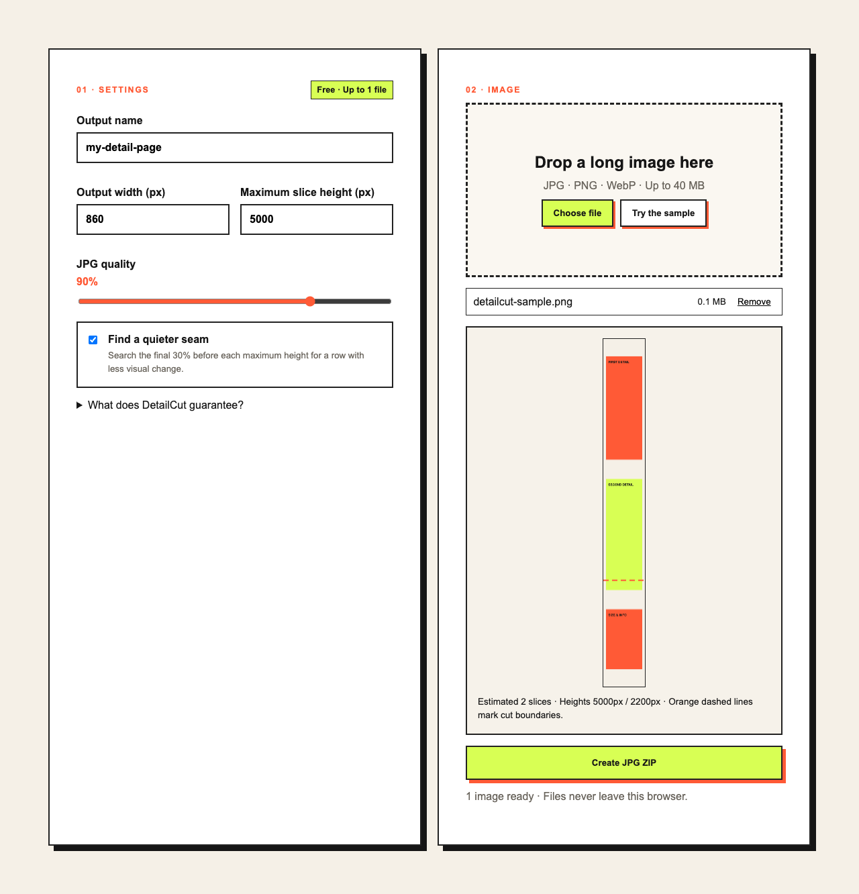

# DetailCut

DetailCut slices a long product-detail image into numbered JPG files and one ZIP. It searches backward from each requested maximum height for a visually quiet horizontal seam, while preserving contiguous output rows. Processing is local to the browser.

**[Use DetailCut in English](https://softpeanut.github.io/detailcut/en.html)** · [Practical splitting guide](https://softpeanut.github.io/detailcut/guide-en.html)

**[무료로 바로 사용하기](https://softpeanut.github.io/detailcut/)** · [상세페이지 이미지 분할 가이드](https://softpeanut.github.io/detailcut/guide.html)



## Quick start

1. Choose one long JPG, PNG, or WebP image, or run the built-in sample.
2. Set an output width and maximum slice height based on the destination's current requirements.
3. Inspect the suggested cut lines, create the ZIP, and review every output boundary before publishing.

The free tool runs locally in the browser, with no upload path or account. Automatic cuts preserve
contiguous rows, but they do not understand text or product meaning.

긴 스마트스토어·오픈마켓 상세 이미지를 단순히 같은 높이에서 자르지 않고, 목표 높이 직전의 비교적 조용한 가로 경계를 찾아 나눕니다. 결과는 `01`, `02`, `03` 순서의 JPG와 ZIP으로 내려받습니다. 이미지 디코딩부터 다운로드까지 브라우저 안에서 처리되며 서버 업로드 경로가 없습니다.

## 무료판 사용법

1. 긴 JPG, PNG 또는 WebP 이미지 1개를 선택합니다.
2. 게시하려는 곳의 최신 안내에 맞춰 출력 폭과 최대 높이를 입력합니다.
3. `JPG ZIP 만들기`를 누르고 결과 조각의 모든 위·아래 경계를 확인합니다.

자동 분할은 이미지의 의미를 이해하거나 특정 쇼핑몰의 등록 승인을 보장하지 않습니다. `860 × 5000`은 수정 가능한 시작값입니다.

## Revenue hypothesis

- Buyer: Korean marketplace sellers and detail-page designers who repeatedly split long exports.
- Free proof: one real image, custom width/height, smart seam selection, real ZIP.
- Paid asset: ₩12,900 one-time offline batch edition for up to 20 images.
- The seller-held paid asset is complete at `dist/detailcut-pro-v1.0.0.zip`; the public page keeps checkout disabled until a real product listing and delivery URL exist.
- Revenue is zero until a non-self purchase settles and is withdrawable.

The product borrows the useful constraints observed in THE Hackathon: a short build, immediately visible output, a free proof before payment, and a five-to-seven-day market test. It does not copy a participant's product or brand.

## Run and verify

```sh
node --test test.mjs
node --check core.js
node --check app.js
sh build-pro.sh
python3 -m http.server 8080
```

Open `http://localhost:8080`. A real browser test with a synthetic tall image should confirm image decode, quiet-seam planning, JPG encoding, ZIP download, and visual continuity before deployment.

`browser-smoke.mjs` performs the decode-to-download path headlessly when Playwright is available. It uses an installed Chrome binary and generates its synthetic image inside the browser; it does not contact an external site.

## Product contract

- Input: JPG, PNG, or WebP; 40 MiB or less per file.
- Output width: 320–2400 px.
- Maximum slice height: 800–10000 px.
- Free edition: one source image. Pro edition: up to 20 source images.
- Automatic cuts are structural guesses, not semantic understanding. Users must inspect the result before publishing.
- No fetch/XHR/WebSocket, external asset, analytics, cookie, local storage, backend, or upload path.

## Material references

- THE Hackathon rules and market-metric structure: https://thehackathon.org/
- Participant retrospective describing 30-hour shipping, one-week revenue validation, and reuse of existing source: https://rriver2.tistory.com/entry/%ED%9D%91%EB%B0%B1%EA%B0%9C%EB%B0%9C%EC%9E%90-%EB%8D%94%ED%95%B4%EC%BB%A4%ED%86%A4-%EC%82%AC%EB%9E%8C%EC%9D%80-%EC%96%B4%EB%96%BB%EA%B2%8C-%EC%84%B1%EC%9E%A5%ED%95%98%EB%8A%94%EA%B0%80

Marketplace dimensions change and are not embedded as compliance claims. The 860 × 5000 defaults are editable working values, not a guarantee of acceptance.
